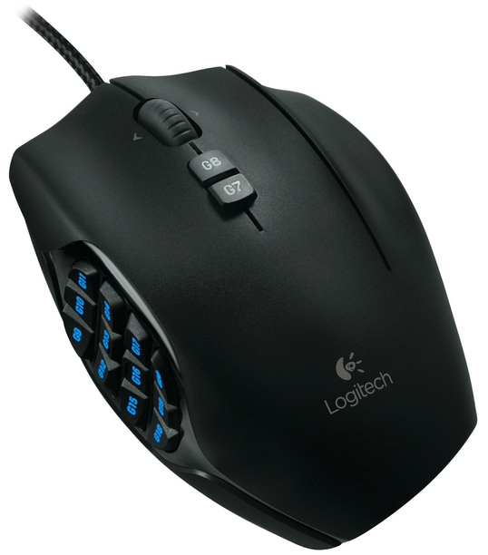
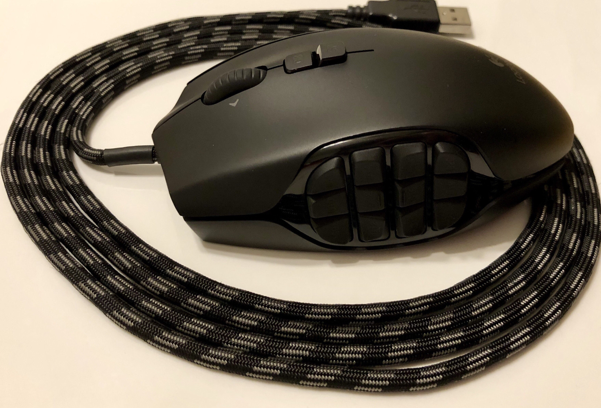
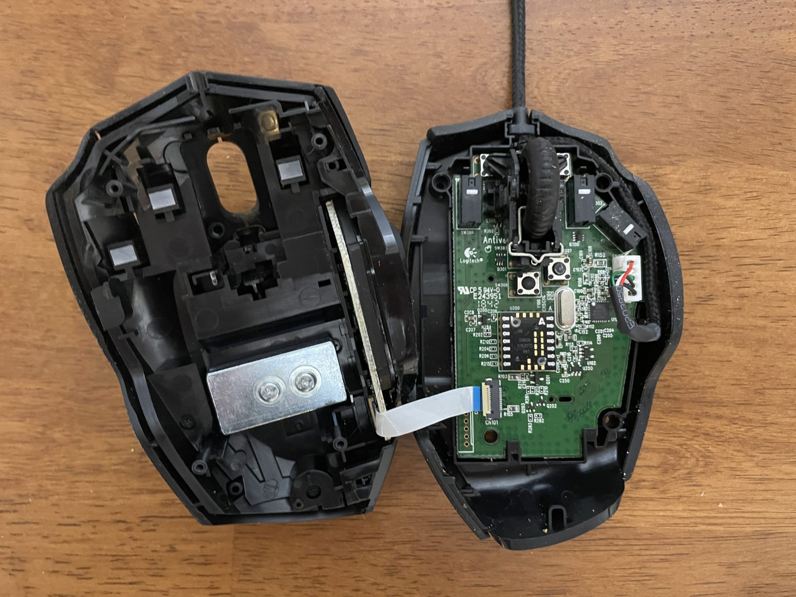
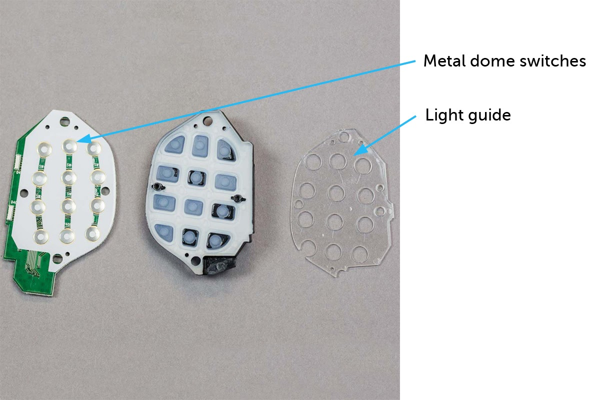

# Logitech G600 Enjoyer
A collection of resources for fans of the tragically discontinued Logitech G600 MMO gaming mouse.

- [Logitech G600 Enjoyer](#logitech-g600-enjoyer)
- [Buy](#buy)
- [Repairs and Upgrades](#repairs-and-upgrades)
  - [Disassembly](#disassembly)
  - [Skate pads](#skate-pads)
  - [Mouse button switches](#mouse-button-switches)
    - [G1, G2, and G3](#g1-g2-and-g3)
    - [G4 to G8](#g4-to-g8)
    - [G9 to G20](#g9-to-g20)
  - [Scroll wheel](#scroll-wheel)
  - [Keypad](#keypad)
  - [Laser tracking Sensor](#laser-tracking-sensor)
  - [USB Cable](#usb-cable)
    - [Wire-to-Board Connector](#wire-to-board-connector)
  - [Weight](#weight)
  - [Grip Tape](#grip-tape)
  - [Top cover](#top-cover)
- [Hardware Programming](#hardware-programming)
  - [Logitech Gaming Software](#logitech-gaming-software)
    - [Logitech Support](#logitech-support)
    - [M-series Mac](#m-series-mac)
  - [Logitech G Hub](#logitech-g-hub)
    - [Lua scripting](#lua-scripting)
    - [Settings](#settings)
    - [Troubleshooting](#troubleshooting)
  - [Logitech Onboard Memory Manager](#logitech-onboard-memory-manager)
  - [g600prog by tulth](#g600prog-by-tulth)
      - [macOS](#macos)
    - [Windows](#windows)
- [Software Programming](#software-programming)
  - [keymapper](#keymapper)
    - [Windows](#windows-1)
- [Sharing Profiles](#sharing-profiles)
  - [Proposed Sharing Profile: F13-F24, NumPad, g600prog, keymapper](#proposed-sharing-profile-f13-f24-numpad-g600prog-keymapper)
    - [View 1](#view-1)
    - [G-Shift + View 1](#g-shift--view-1)
    - [View 2](#view-2)
    - [G-Shift + View 2](#g-shift--view-2)
  - [Profile Discussion](#profile-discussion)
- [Further Reading](#further-reading)
  - [Trivia](#trivia)
  - [Other Software](#other-software)
  - [Specifications](#specifications)
  - [Reviews](#reviews)
  - [Alternative Mice](#alternative-mice)
  - [General Mouse Resources](#general-mouse-resources)


# Buy
Despite its discontinuation, there isn't exactly a competitor that fills its place.

The G600 isn't coming back, so buy a few and store them in a safe place. Follow the 3-2-1 rule of backups: 3 copies, 2 different media (doesn't apply, so maybe 2 colours?), 1 off-site. Search used listings on [eBay](https://www.ebay.com/sch/i.html?_nkw=g600+g600t), [Craigslist](https://craigslist.org), [Kijiji](https://www.kijiji.ca), etc. 

Look for Logicool G600t ([Amazon.co.jp](https://www.amazon.co.jp/dp/B01D45U6LA)) and G600r ([Amazon.co.jp](https://www.amazon.co.jp/ロジクール-G600r-LOGICOOL-MMOゲーミングマウス/dp/B00CDCL21O?th=1)) sold in Japan. [Reddit](https://old.reddit.com/r/LogitechG/comments/1exw62n/the_logicool_g600t_japanese_ver_of_logitech_g600/)


# Repairs and Upgrades
If you have one already but it's not functioning, repair it. Resoldering new switches is the main fix, but soldering isn't always required.

Best G600 that I’ve done so far: 88.3g, Endgame Cables Paracord, Hotline Competition 3.0 skates. [Reddit](https://old.reddit.com/r/MouseReview/comments/djg3yl/best_g600_that_ive_done_so_far_883g_endgame/)


Modified Logitech G600 with MX Cherry Speed Switches
[Reddit](https://old.reddit.com/r/MouseReview/comments/g2cbye/modified_logitech_g600_with_mx_cherry_speed/)


## Disassembly



[Logicool] Introducing 3 ways to reduce the weight of the G600 [Light weight reduction] [Norishiba](https://norishiba.com/g600-heavy-weight/)

Logitech G600 滑鼠 拆解 & 按鍵更換 OMRON D2F-01F (Disassembly and micro switch replacement) [michtw](https://michtw.blogspot.com/2016/07/logitech-g600-omron-d2f-01f-disassembly.html)

Teardown Showdown: Logitech Gaming Mouse Edition G600 MMO vs G502 Proteus Core [Fictiv](https://www.fictiv.com/teardowns/teardown-showdown-logitech-gaming-mouse-edition-g600-mmo-vs-g502-proteus-spectrum)

LOGITECH G600 TEARDOWN AND RESURRECTION by HomeBrewedHero [YouTube](https://www.youtube.com/watch?v=5sQ_b9j75Nw&t=120s)

## Skate pads
To open up the mouse, there's a chance you'll damage the original skate pads, so order some replacements before you get started.

[Corepad Skatez 07919 - PRO 76](https://www.corepad.de/en/Corepad-Skatez-Logitech-Teflon-Mousefeet-Mouse-Feet-Hyperglides-Hyperglide/Corepad-Skatez-PRO-76-Mouse-Feet-Logitech-G600.html)

[Feetglide FG-077](https://feetglide.com/shop/glides/feetglide-skates-for-logitech-g600-fg-077/)

[Hotline Games 3.0](https://www.amazon.com/dp/B08MBZDS1H?th=1)

## Mouse button switches
There are lots of YouTube videos demonstrating how to repair or replace mouse buttons and switches. I've pulled together a list of ones specific to the G600:
1. Logitech G600 Button Repair - No Soldering by Family Home Theater [YouTube](https://www.youtube.com/watch?v=-vt4etUt-xk)
1. Logitech G600 Repair: Fixing Unresponsive Buttons & Deep Cleaning [YouTube](https://www.youtube.com/shorts/UWMUkq0hVw8)
1. Mouse Repair – Right mouse button switch replacement – Logitech G600 by Grumpy Old Geek [YouTube](https://www.youtube.com/watch?v=rkGKNDlp-Pk)
1. [Junk] Repairing the super convenient 20-button gaming mouse Logitech G600 by ozoz japan [YouTube](https://www.youtube.com/watch?v=3amfAFXKCh8)
1. Logitech G600 MMO Repair - Button Switch Replacement by QuickFix [YouTube](https://www.youtube.com/watch?v=pvZ9KhIhLNE)
1. how to fix logitech g600 mouse double clicking by ayang09 [YouTube](https://www.youtube.com/watch?v=Emx79MpJm2E)

### G1, G2, and G3
1. Original: OMRON D2FC-F-7N(20M)
    * [Octopart](https://octopart.com/d2fc-f-7n%2820m%29-omron-131296229)
    * [Datasheet](https://components.omron.com/us-en/sites/components.omron.com.us/files/datasheet_pdf/B152-E1.pdf)
1. Definitive Omron Switch Guide for Mice [GeekHack](https://geekhack.org/index.php?topic=81743.0)
2. Building the Mouse Logitech Won't Make [Sam Wilkinson](https://samwilkinson.io/posts/2025-08-24-mx-ergo-mods)
3. Logitech G600: Replace OMRON D2FC-F-7N(20M) switches with OMRON D2FC-F-K(50M)? [Reddit](https://www.reddit.com/r/MouseReview/comments/jpz3mc/comment/gbk6j9n/)
    1. Omron D2F-01F (w/ plunger mod)
    2. Kailh GM 8.0, 2.0 or 4.0
    3. Zippy DF3
    4. Huano Blue-shell Blue-point
    5. TTC Gold Dustproof (newer revision)
    6. Honeywell UX10C
    7. Cherry ZF DGBE-FL60
4. Micro Switch [Lethal Games](https://lethal.gg/collections/micro-switch)

### G4 to G8
1. Original: Omron B3F-1000
    * [Octopart](https://octopart.com/b3f-1000-omron-3117)
    * [Datasheet](https://omronfs.omron.com/en_US/ecb/products/pdf/en-b3f.pdf)

### G9 to G20
Not much information 


## Scroll wheel
Logitech G600 Scroll Wheel by krx [Printables](https://www.printables.com/model/454993-logitech-g600-scroll-wheel)

## Keypad
Fix intermittent keypad [iFixit](https://www.ifixit.com/Guide/How+to+fix+Logitech+G600+intermittent+keypad+buttons/155289)

## Laser tracking Sensor
Not sure much can be done if the sensor is damaged, but it is used in [DIY mice](https://pepijndevos.nl/2015/05/29/adns-9800-hookup-guide.html) and robotics projects using Arduino and Teensy microcontrollers. File this repair under "technically anything is possible."

ADNS-9800 Motion Sensor [Tindie](https://www.tindie.com/products/citizenjoe/adns-9800-motion-sensor/)

mrjohnk/ADNS-9800 [Github](https://github.com/mrjohnk/ADNS-9800) 

## USB Cable
OP1 Flex Cord 5.0 [Endgame Gear](https://www.endgamegear.com/en-us/accessories/op1-flex-cord-5-0)

Mouse Cables [Zerk Gaming Mods](https://zerkgamingmods.co.uk/product-category/mouse-cables/)

Plenty available across Aliexpress, eBay, [Amazon](https://www.amazon.ca/SZYDD-Original-Replacement-Braided-1-7-2M/dp/B0DHL3X5ZH), Walmart, etc.

Installing a paracord cable from Lethal Gaming Gear on a Logitech G403 by MagneticGray [Imgur](https://imgur.com/a/5z8q7E7)

### Wire-to-Board Connector
Possibly uses a [JST-SH](https://www.jst.com/products/crimp-style-connectors-wire-to-board-type/sh-connector/) 5-pin wire to board connector, `SHR-05V-S-B`. Will need to investigate further.

* [Octopart](https://octopart.com/search?q=SHR-05V-S-B)

## Weight
[Logicool] Introducing 3 ways to reduce the weight of the G600 [Light weight reduction] [Norishiba](https://norishiba.com/g600-heavy-weight/)

How to make your Mouse LIGHTER? (Weights Removal in Logitech G600 MMO Gaming Mouse) [Youtube](https://www.youtube.com/watch?v=PIg7q7rOKc8)

Weight reduction of G600(Logicool) by removal of the weight. [YouTube](https://www.youtube.com/watch?v=AVB28cqGUnM)

## Grip Tape
[Hotline Games](https://www.amazon.com/dp/B091K7JT2R?th=1)

## Top cover
Top piece replacement for Logitech g600 Mouse by Grosskopfgames [Thingiverse](https://www.thingiverse.com/thing:2747969)

# Hardware Programming

[python-hidapi-logitech-g600](https://github.com/ecerulm/python-hidapi-logitech-g600) has a nice explanation of how the codes in the G600's keyboard 

## Logitech Gaming Software
The original software that worked with the G600 when it was released. Still works on Windows 11. Handy to have as a daily driver or backup when G HUB doesn't work.

Missing some of the newer macro functions of G HUB.

On Windows 11, I sometimes get a bug where the DPI won't set correctly after a reboot until I start LGS and open the DPI page.

Download: [Logitech](https://support.logi.com/hc/en-in/articles/360025298053-Logitech-Gaming-Software) [Archive](https://web.archive.org/web/20240327185302/https://support.logi.com/hc/en-in/articles/360025298053-Logitech-Gaming-Software)

### Logitech Support
1. Getting started - G600 MMO Gaming Mouse Logitech [Archive](https://archive.is/KmFZ8)
1. G600 MMO Gaming Mouse [Logitech (Archive)](https://archive.is/MrZ1w)
1. Using on-board memory or application detection with the G600 gaming mouse [Logitech (Archive)](https://archive.is/NbVXR)
1. Configuring the G600 gaming mouse buttons [Logitech (Archive)](https://archive.is/BIEQe)

### M-series Mac
1. [Andrew Imeson - Logitech G600 on M1 Mac](https://micro.andrewimeson.com/p/logitech_g600_m1_mac/)

## Logitech G Hub
[Download for Windows and macOS](https://www.logitechg.com/en-ca/software/ghub)

Pros:
- Newer software with wider support for devices
- Game profiles
- More advanced macros than LGS
- [Lua scripting](https://luascripts.com/logitech-lua-scripting)

Cons:
- Rather bloated piece of software if you only want some simple macro buttons.
- Doesn't always work properly on Windows.
- Doesn't seem to work on M-series Macs with the G600.
- Doesn't support Linux.

Strikes an important naming convention:

    View 1 -> Top of the mouse

    View 2 -> Keypad on the side

### Lua scripting
[Lua Cheatsheet for Logitech G Hub](https://github.com/jehillert/logitech-ghub-lua-cheatsheet) by jehillert

### Settings
Back up your programmed settings in G HUB.

Windows:

    C:\Users\<USERNAME>\AppData\Local\LGHUB\settings.db


macOS:

    /Users/<USERNAME>/Library/Application Support/lghub/settings.db

### Troubleshooting
Update drivers from Device Manager [Reddit](https://old.reddit.com/r/LogitechG/comments/w9tpji/g600_mouse_stuck_on_loading_resources/iq9gk14/?context=10000)

As per Logitech Support, uninstall and reinstall G HUB [Reddit](https://old.reddit.com/r/LogitechG/comments/wpr5x6/g_hub_doesnt_recognize_g600_anymore/iki7jvq/?context=10000)
1. Uninstall G HUB
2. Make sure none of the G HUB components are running in the Task Manager
3. Delete the following directories:
    * `C:\Program Files\LGHUB`
    * `C:\ProgramData\LGHUB`
    * `C:\Users\<USERNAME>\AppData\Local\LGHUB`
    * `C:\Users\<USERNAME>\AppData\Roaming\LGHUB`
4. Delete registry key
    * `HKLM\SOFTWARE\Microsoft\Windows\CurrentVersion\Uninstall\{521c89be-637f-4274-a840-baaf7460c2b2}`
5. Reboot the PC
6. Re-install G HUB.
7. If issue persists, install Logitech Gaming Software.

Apps like [Bulk Crap Uninstaller](https://www.bcuninstaller.com) and [PearCleaner](https://itsalin.com/appInfo/?id=pearcleaner) make the uninstallation process a bit easier.

## Logitech Onboard Memory Manager
[Download](https://support.logi.com/hc/en-in/articles/360059641133-Onboard-Memory-Manager)

G HUB without the macros.

I couldn't get it to work on my Windows 11 PC. *shrug*

## g600prog by tulth
Cross-platform script to program the G600 using Python
https://github.com/tulth/g600prog

Python 3: https://www.python.org/downloads/

Install prerequisites: 

```
pip install pyusb libusb
```
#### macOS
Per [installation instructions](https://github.com/houmain/keymapper?tab=readme-ov-file#macos), need Karabiner Elements' virtual device driver. I couldn't get the standalone driver to work, so I just installed the full Karabiner Elements.

On macOS, use the following command to download the current config from the mouse to your Mac:
```
sudo python3 g600prog.py MOUSE current_mouse_cfg.json
```

To upload a new config from your Mac to the mouse, use:
```
sudo python3 g600prog.py default_fnumpad.json MOUSE
```
Here's what the output will look like.
```
% sudo python3 g600prog.py default_fnumpad.json MOUSE
Reading mouse config from file >default_fnumpad.json< ...
... done reading mouse config from file
Writing the mouse config to the mouse...
...done writing read mouse config to the mouse
```

### Windows
Not recommended, in my experience, especially since I wanted to use keymapper. Logitech Gaming Software and G HUB were far simpler.

PyUSB requires libusb, but . To replace the mouse driver with libusb on Windows, use Zadig.
1. Create a System Restore point.
2. Download Zadig: https://zadig.akeo.ie
    1. The latest version is 2.9 as of this writing.
3. Run `zadig-2.9.exe`.
4. In the toolbar, navigate to `Options > List All Devices`.
5. In the dropdown menu, select `Gaming Mouse G600 Interface 1`.
    1. If I understand correctly, `Interface 0` drives the mouse cursor, whereas `Interface 1` is the driver for the buttons/keyboard.
6. Under Driver, select `libusb-win32 (v1.4.0.0)`.
7. Click the `Replace Driver` button.

I installed `WinUSB` by accident, and it was a tricky bugger to remove. There are a few apps that can help with the process.

1. Delete driver.
   1. Device Manager
      1. Show hidden/disconnected deviceps [Microsoft](https://support.microsoft.com/en-us/topic/device-manager-does-not-display-devices-that-are-not-connected-e7148232-40ae-bb07-0077-88f2e859b53f)
   2. [Driver Store Explorer](https://github.com/lostindark/DriverStoreExplorer)
      1. Create a System Restore point.
      2. Run as admin.
      3. Delete the `g600.inf` driver by `libuwb`.
2. Delete records of the G600 in the Registry.
   1. Back up registry.
   2. Create System Restore point.
   3. This is tricky to do manually since even with Administrator privileges, you can't delete certain registry keys. Instead, you need to use the System account. Fortunately there are apps that can automate this operation.
   4. [Device Cleanup Tool](https://www.uwe-sieber.de/misc_tools_e.html) by Uwe Sieber
      1. Run as administrator.
      2. Unplug G600.
      3. Click F5 to refresh devices.
      4. Select all of the G600 devices that appear now that it is disconnected from the system.
   5. [USBDeview](https://www.nirsoft.net/utils/usb_devices_view.html) by NirSoft
   6. [USBOblivion](https://github.com/raspopov/USBOblivion) by cherubicsoft
   7. [Ghostbuster](https://bitbucket.org/wvd-vegt/ghostbuster/src/master/) by Wim van der Vegt

Download or clone the `g600prog` repository.

```
git clone https://github.com/tulth/g600prog
cd g600prog
```
For Windows, download the `g600prog.py` file provided in this repo under profiles/g600prog. Added a small patch to check if platform is Windows before running a Linux driver command.


On Windows, use the following command to download the current config from the mouse to your Windows PC:
```
python g600prog.py MOUSE current_cfg.json
```

To upload a new config from your Windows PC to the mouse, use:
```
python g600prog.py new_mouse_cfg.json MOUSE
```

# Software Programming
Though the hardware programming enables an expansion of functions that can be called from the mouse, the software programming can expand that number even more. This customizability and density sits at the core of the G600's power and beauty.

Since the keypad is recognized as a keyboard under the Human Interface Device (HID) class within the OS, we can use any keyboard remapping software.

## keymapper
[keymapper](https://github.com/houmain/keymapper) is a powerful cross platform, context-aware keyboard remapper with a text-based configuration system. 

Most importantly, it can automatically switch behaviours based on attributes like the OS, the window title, device name/ID, etc. For example, G HUB can target a web browser application, but if I set it to a browser, it can't change the G600's keys based on the website. Using keymapper, I can use the [title] tag so that my G600 has unique key combinations for that website.

### Windows
Per [installation instructions](https://github.com/houmain/keymapper?tab=readme-ov-file#virtual-device-driver), some users may need to set up [Interception](https://github.com/oblitum/Interception) in order to filter by device.

I use it so I can assign macros to the Numpad keys hardware-programmed onto my G600 but still use the Numpad on my keyboard as usual.
1. Clone or download the Interception repository.
2. Run Command Prompt/Terminal as Administrator.
   1. Type Win + X, then click A.
3. Navigate to `Interception\command line installer`.
4. Run the following command:
   1. `.\install-interception.exe /install`
5. Reboot.
6. Navigate to `Interception\library` and select the appropriate directory for your CPU architecture.
7. Copy `interception.dll` to the same folder as your `keymapperd` executables, e.g., `C:\Program Files\keymapper`.

# Sharing Profiles
If the G600 is programmed with a hardware configuration that has better default keycodes, then software configurations can be more easily shared. G HUB already does this with updates to the hardware profiles for different games, but they stopped short of productivity apps and additional software profiles.

Each workflow maps a little differently based on the user's brain because of things like training, muscle memory, games/applications, etc. But surely there are enough similarities out there that all G600 and MMO mouse users can benefit.

The main limitation of this approach is that the number of "unused" keycodes is limited and dependent on your specific workflows. Also, if you use multiple modes, then there aren't enough unused keycodes that can be used across all 173 possible keys.

Logitech updates G HUB with profiles for the latest games, but that doesn't reach to other applications or web apps. There could and should be some way for the G600 community to share their configs easily, either through programming the hardware keys or with a generic set of hardware keys and a common software layer that handles the application switching.

## Proposed Sharing Profile: F13-F24, NumPad, g600prog, keymapper
The "What":
1. F13 through F24 for View 2
2. Numpad for G-Shift of View 2 and some of View 1.
   1. This is already the default

The "How":
1. Program the keypad with proposed default config ([default_fnumpad.json](default_fnumpad.json)) using g600prog
2. G Hub and LGS can be used to program mice this way as well.
   1. A `settings.db` file could be shared.
3. Customize profile with keymapper.
   1. For those that use Numpad on keyboards, keymapper can restrict remapping to just the G600 using `[device="Gaming Mouse G600"]`.
4. Share!
   1. How to build a community/social network around a single electronic device? I don't know, but I'm open to ideas.

### View 1
1. #G1 = LeftMouse
1. #G2 = RightMouse
1. #G3 = MiddleMouse
1. G4 = NumpadMultiply
1. G5 = NumpadDivide
1. #G6 = GShift
1. G7 = NumpadAdd
1. G8 = NumpadSubtract

### G-Shift + View 1
1. #SG1 = 
2. #SG2 = 
3. #SG3 = 
4. #SG4 = 
5. #SG5 = 
6. #SG6 = # You can't use G-Shift with itself, silly
7. #SG7 = 
8. #SG8 = 

### View 2
1. G9 = F13
1. G10 = F14
1. G11 = F15
1. G12 = F16
1. G13 = F17
1. G14 = F18
1. G15 = F19
1. G16 = F20
1. G17 = F21
1. G18 = F22
1. G19 = F23
1. G20 = F24

### G-Shift + View 2
1. SG9 = Numpad7
1. SG10 = Numpad8
1. SG11 = Numpad9
1. SG12 = Numpad4
1. SG13 = Numpad5
1. SG14 = Numpad6
1. SG15 = Numpad1
1. SG16 = Numpad2
1. SG17 = Numpad3
1. SG18 = Numpad0
1. SG19 = NumpadDecimal
1. SG20 = NumpadEnter

## Profile Discussion
G600 mouse button beyond 4 and 5 [Reddit](https://old.reddit.com/r/LogitechG/comments/11a49es/g600_mouse_button_beyond_4_and_5/)

Logitech G600 mouse with 20+ buttons onboard [AutoHotkey](https://www.autohotkey.com/boards/viewtopic.php?t=78024)

# Further Reading
## Trivia
Logitech G600 is Antivenom  [Easter Egg] [Stranger's Weblog](https://strangera.com/2012/09/05/logitech-g600-is-antivenom/)

## Other Software
Software alternatives, with some comments on ones I've used in the past.

1. macOS
   1. [Mos](https://mos.caldis.me) by Caldis
      1. Enables smooth scrolling for the mouse wheel.
   2. [LinearMouse](https://github.com/linearmouse/linearmouse) by LinearMouse
      1. Individual settings, i.e., scroll direction, for each mouse so that I can still use natural scrolling on my trackpad.
   3. [Karabiner Elements](https://karabiner-elements.pqrs.org)
      1. Installs driver extension required by keymapper.
   4. [python-hidapi-logitech-g600](https://github.com/ecerulm/python-hidapi-logitech-g600) by ecerulm
      1. Similar to g600prog, but a bit more involved. 
   5. [SteerMouse](https://plentycom.jp/en/steermouse/index.html) by PLENTYCOM SYSTEMS
      1. Detects the low level keycodes of all the G600 buttons and wheel scrolls, e.g., it can detect when G-Shift is clicked.
      2. I had collisions with other applications like BetterTouchTool.
   6. [USB Overdrive](https://www.usboverdrive.com) by Alessandro Levi Montalcini
      1.  Installs driver extension to take full control of all USB devices.
   7. [BetterMouse](https://better-mouse.com) by thePadToo
      1. Works great for my Logitech MX Master 3S
      2. Enables physical key substitution but not to the same depth as SteerMouse. Only a hard-coded set of substitutions as well.
   8. [BetterTouchTool](https://folivora.ai) by folivora.AI
      1. I install it every time I set up a Mac with a trackpad.
   9.  [Mac Mouse Fix](https://macmousefix.com/) by Noah Nuebling
   10. [Scroll Reverser](https://pilotmoon.com/scrollreverser/)
      1. Wouldn't reverse the scroll on my trackpad on Tahoe 26.1.
   11. [Hammerspoon](https://www.hammerspoon.org)
       1. Automation software for Lua on macOS
       2. [A Better Hyper Key Hack for Sierra](https://brettterpstra.com/2016/09/29/a-better-hyper-key-hack-for-sierra/)
2. Linux
   1. [Logitech G600 on Linux](https://github.com/mafik/logitech-g600-linux)
   2. [piper](https://github.com/libratbag/piper) by libratbag
      1. GTK application to configure gaming devices
   3. [Logitech G600 Driver For Linux](https://github.com/danhab99/logitech-g600-py)
      1. This repo contains scripts for a valid parser for the Logitech G600 mouse
   4. [lg600r](https://github.com/Dessix/lg600r) by Dessix
        1.  Linux Logitech G600 macro key hooking in Rust
3. Windows
   1. [AutoHotkey](https://www.autohotkey.com)
      1. I can't wrap my head around the programming language.
4. Cross-platform
   1. [kmonad](https://github.com/kmonad/kmonad)

## Specifications
Highlighting just some of the interesting ones.

Weight: 133 g

Sensor: S9808/ADNS-9800 by Broadcom/Avago 
* ADNS-9800 Broadcom / Avago [Mouser](https://www.mouser.com/ProductDetail/Broadcom-Avago/ADNS-9800?qs=L%2FQzK8yiqlbEdsRjFWYizQ%3D%3D)
* kbjunky/ADNS-9800 Breakout Board [GitHub](https://github.com/kbjunky/ADNS9800)

DPI: 200 to 8200

Polling rate: 1000 Hz

USB VID_PID: `VID_046D&PID_C24A`
1. Logitech G600 MMO Gaming Mouse Technical Specifications [Logitech Support](https://support.logi.com/hc/en-us/articles/360023465173-Logitech-G600-MMO-Gaming-Mouse-Technical-Specifications)
1. Logitech G600 MMO [Mouse Specs](https://mousespecs.org/logitech-g600-mmo/)

## Reviews
1. Logitech G600 | Make your work a game by DOTS [YouTube](https://www.youtube.com/watch?v=EEOqG3mcUnw)
1. This gaming mouse really stepped up my music production game! by 52Cues [YouTube](https://www.youtube.com/shorts/EWTQYNNIT-8)
1. We Review The Logitech G600 Mouse: Photoshop Gamechanger [Fstoppers](https://fstoppers.com/reviews/review-logitech-g600-mouse-photoshop-gamechanger-578082)
1. [Logicool] 5 points to note for gaming mice for G600 MMO. [Norishiba](https://norishiba.com/g600-5factor/)
1. Review: Logitech’s G600 MMO Gaming Mouse Gives the Razer Naga a Run for Its Money [The Mary Sue](https://www.themarysue.com/review-logitech-g600-mmo-gaming-mouse/)
1. Logitech G600 MMO Gaming  Mouse Review [RTings](https://www.rtings.com/mouse/reviews/logitech/g600-mmo-gaming)
1. LOGITECH G600 MMO GAMING MOUSE REVIEW [Custom PC Review](https://www.custompcreview.com/reviews/logitech-g600-mmo-gaming-mouse-review/)
1. Logitech G600 MMO Gaming Mouse Review [Overclockers Club](https://www.overclockersclub.com/reviews/logitech_g600_mmogamingmouse/)
1. Logitech G600 MMO Gaming Mouse Review [Gamers Nexus](https://gamersnexus.net/hwreviews/1048-logitech-g600-mmo-mouse)
1. WHEN DID THE LOGITECH G600 ORIGINALLY COME OUT & HAS IT BEEN DISCONTINUED? [Slashgear](https://www.slashgear.com/1625874/logitech-g600-discontinued-when-did-come-out/)
1. Logitech G600 MMO Gaming Mouse Unboxing & First Look by Linus Tech Tips [YouTube](https://www.youtube.com/watch?v=MPnqmuuXcFM)

## Alternative Mice
For when you've given up on Logitech and the G600.

Productivity mice MEGA-REVIEW: 15 mice compared including G502, G600, G604, Naga, Leadr, Swiftpoint Z, and more [Reddit](https://old.reddit.com/r/MouseReview/comments/lp1v1z/productivity_mice_megareview_15_mice_compared/)

## General Mouse Resources
1. Mouse Guide 2.0: A list of mice with superior sensors and more. [GeekHack](https://geekhack.org/index.php?PHPSESSID=bcc2m478o7flnakttvcctp6qhse82q54&topic=56240.0)
1. Mouse Speed & Acceleration Test [XbitLabs](https://www.xbitlabs.com/mouse-speed-acceleration-test/)